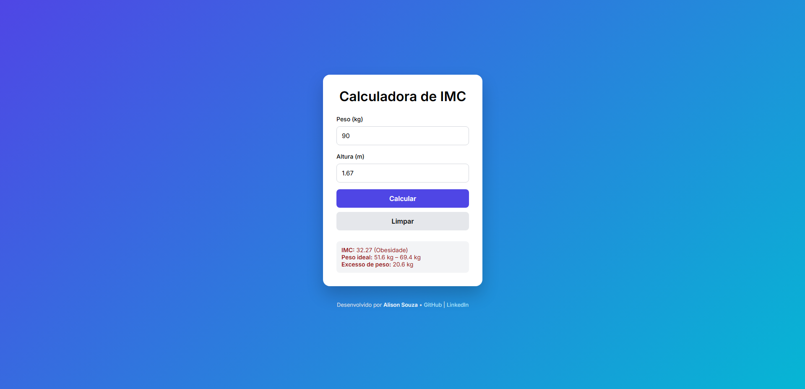

# 🧮 Calculadora de IMC


## 💻 Preview



Projeto de uma **Calculadora de IMC (Índice de Massa Corporal)** desenvolvida com foco em **boas práticas de front-end**, **UX**, **validações** e **organização de código**, ideal para portfólio e processos seletivos de estágio/júnior.

---

## 📌 Sobre o projeto

A aplicação permite que o usuário informe seu **peso** e **altura**, calcule automaticamente o IMC e exiba:

- Valor do IMC
- Classificação (OMS)
- Faixa de peso ideal
- Quantos quilos está acima do peso (se aplicável)

O projeto foi pensado para ser **simples, intuitivo e acessível**, simulando um cenário real de aplicação web.

---

## 🚀 Funcionalidades

- Cálculo automático do IMC
- Classificação baseada nos padrões da OMS
- Exibição do peso ideal mínimo e máximo
- Cálculo do excesso de peso
- Validações de dados (peso e altura)
- Inserção automática do ponto na altura (ex: `167 → 1.67`)
- Suporte à tecla **Enter** para calcular
- Interface moderna e responsiva
- Footer com links profissionais

---

## 🖥️ Tecnologias utilizadas

- **HTML5**
- **CSS3**
- **JavaScript (Vanilla JS)**

---

## 🛠️ Como usar o projeto

1. **Clone o repositório:**

   ```bash
    git clone https://github.com/alison-souza/imc-calculator.git
   ```

2. **Abra o diretório**

   ```bash
    cd imc-calculator
   ```

3. **Inicie o arquivo: Basta abrir o arquivo index.html em qualquer navegador moderno.**

---

## 📂 Estrutura do projeto

```text
calculadora-imc/
│
├── index.html
├── style.css
├── script.js
└── README.md
```
